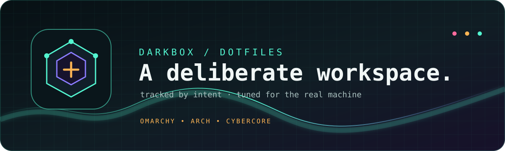

# `darkbox-dotfiles`

<p align="center">
  
</p>

<p align="center">
  <strong>🧩 A deliberate Linux workspace, rebuilt one file at a time.</strong><br>
  <sub>Omarchy · Arch Linux · Cybercore tools · terminal-first workflows</sub>
</p>

<p align="center">
  
  
  
  
</p>

> Personal configuration for **darkbox** — a hand-tuned Omarchy workstation and the place where Cybercore tools get exercised in the real world.

## ✦ What this is

This repository tracks the configuration I intentionally want to reproduce across machines. It is not a dump of every file in `$HOME`: caches, credentials, vaults, machine-specific state, and generated noise stay out.

The design language is **dark + neon + functional**: quiet surfaces, high-signal accents, and shortcuts that stay close to the metal.

## 🧭 Managed with `config`

The repository uses the bare-repository dotfiles pattern. The alias is kept in `.bashrc` and points Git at this repository while leaving `$HOME` as the work tree.

```bash
# See what is currently tracked or changed
config status

# Add only files you have reviewed
config add .config/hypr/hyprland.conf .config/ghostty/config

# Review exactly what will be committed
config diff --cached

# Save a focused change
config commit -m "feat: tune workspace navigation"

# Publish the selected files
config push -u origin main
```

### First-time setup on another machine

```bash
git clone --bare git@github.com:darkstardevx/darkbox-dotfiles.git "$HOME/.dotfiles"
echo 'alias config="/usr/bin/git --git-dir=$HOME/.dotfiles/ --work-tree=$HOME"' >> "$HOME/.bashrc"
source "$HOME/.bashrc"
config config --local status.showUntrackedFiles no
```

Review a file before restoring it. To restore the tracked tree deliberately:

```bash
config checkout
```

## 🧱 Principles

| Signal | Rule |
| --- | --- |
| 🛡️ Secrets | Never commit API keys, tokens, private keys, vaults, or `.env` files. |
| 🎯 Intent | Add files explicitly; the home directory is not an automatic upload queue. |
| 🧪 Review | Inspect `config diff --cached` before every commit. |
| 🧹 Hygiene | Keep caches, sessions, logs, downloads, and generated state out. |
| 🔁 Recovery | Make focused commits so a bad change is easy to identify and revert. |

## 🗂️ Asset pack

The small visual system in [`dotfiles-assets/`](dotfiles-assets/) is made for this repository and follows the Cybercore palette:

- `brand/darkbox-banner.svg` — GitHub README header
- `brand/darkbox-mark.svg` — square repository mark
- `emojis/sync.svg` — safe sync / upload marker
- `emojis/terminal.svg` — shell and system tooling marker
- `emojis/shield.svg` — security and secret hygiene marker
- `emojis/bolt.svg` — fast, experimental, high-signal changes

The assets are SVG-first so they remain sharp in README previews, terminal-adjacent documentation, and future theme work.

## 🔐 Secret handling

Keep local secrets outside the tracked work tree or in an ignored file with restrictive permissions:

```bash
chmod 600 ~/.config/darkbox/secrets.env
```

If a credential is ever exposed, revoke it immediately, remove it from every local commit, and create a replacement. Never use a repository unblock link to publish a live secret.

## 🌌 Related work

This workstation is part of the Cybercore tool family — Rust, Lua, shell, and Omarchy tooling built around practical systems work. The public project home is maintained separately from this private-machine configuration.

## License

Personal configuration. Reuse ideas freely; adapt paths and hardware-specific settings before applying them to another system.

